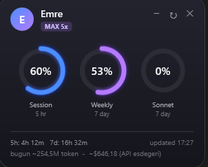

# claude-kullanim-widget

Claude (Pro / Max) kullanım limitlerini masaüstünde **her zaman üstte** gösteren, hafif bir Windows widget'ı. Kurulum gerektirmez — sadece PowerShell + WPF (Windows'ta yerleşik gelir).

> Bu araç **resmî değildir** ve Anthropic ile ilişkisi yoktur. Claude Code'un kendi kullandığı dahili endpoint'i çağırır.

<p align="center">
  
</p>

## Görünüm

- 3 dairesel **donut halka**: Session (5 saat), Weekly (7 gün) ve modele özel haftalık limit (ör. `Fable` / `Opus` / `Sonnet`) — API'nin `limits` dizisinden **dinamik** okunur
- Kullanım arttıkça halka rengi değişir: normal → **sarı** (≥%75) → **kırmızı** (≥%90)
- Her halkanın altında canlı **reset geri sayımı** (ör. `4h 17m`, `5d 0h`)
- Avatar + isim + plan rozeti (ör. `MAX 5x`) — profilden otomatik
- `bugün ~X token · ~$Y (API eşdeğeri)` — yerel oturum dosyalarından
- **Küçültme modu**: tıklayınca küçük bir yuvarlağa iner, yuvarlağa tıklayınca tekrar açılır
- Her yerinden sürüklenebilir, akıcı dolum animasyonları, neon glow

## Gereksinimler

1. **Windows** (PowerShell 5.1+ ve .NET/WPF — hepsi yerleşik)
2. **Claude Code / CLI kurulu ve giriş yapılmış** olmalı. Widget kimlik bilgisini
   `~/.claude/.credentials.json` dosyasındaki OAuth token'dan okur. Sadece tarayıcıdan
   claude.ai kullanıyorsan bu dosya oluşmaz → widget çalışmaz.
3. İnternet bağlantısı.

## Çalıştırma

`start.vbs` dosyasına **çift tıkla** — widget konsol penceresi açmadan sessizce başlar.

### Windows açılışında otomatik başlatma

```powershell
$s = (New-Object -ComObject WScript.Shell).CreateShortcut("$env:APPDATA\Microsoft\Windows\Start Menu\Programs\Startup\ClaudeUsage.lnk")
$s.TargetPath = "$env:USERPROFILE\claude-kullanim-widget\start.vbs"
$s.Save()
```

## C# / WPF sürümü (önerilen)

Aynı widget'ın C# sürümü [ClaudeUsageWidget/](ClaudeUsageWidget/) klasöründedir. İki görünüm (donut halkalar / araba hız göstergesi), ayarlanabilir renk paleti, arka plan saydamlığı, Windows'ta otomatik başlatma ve otomatik güncelleme bildirimi içerir.

**Kullanıcılar için:** [Releases](https://github.com/emreyilmaz99/claude-kullanim-widget/releases/latest) sayfasından `ClaudeUsageWidget-vX.Y.Z.exe` dosyasını indirip çift tıkla. Küçük, tek dosyalık bir exe'dir.

Bir kereye mahsus **[.NET 8 Desktop Runtime](https://dotnet.microsoft.com/download/dotnet/8.0)** (x64) gerekir — yoksa exe'yi ilk çalıştırdığında Windows otomatik olarak indirme bağlantısı gösterir. (Not: exe imzasız olduğu için antivirüs nadiren "yanlış pozitif" verebilir; framework-dependent olduğundan bu ihtimal çok düşüktür, gerekirse dosyaya izin ver.)

**Derlemek için** .NET 8 SDK:

```powershell
dotnet build ClaudeUsageWidget -c Release
.\ClaudeUsageWidget\bin\Release\net8.0-windows\ClaudeUsageWidget.exe
```

- `start.vbs`'e gerek yok — exe konsol penceresi açmadan başlar.
- PowerShell sürümüyle aynı mutex'i kullanır; ikisi aynı anda çalışmaz, ikinci kopya mevcut pencereyi öne getirir.
- Ayarlardan (⚙) "Windows açılışında başlat" seçeneğiyle otomatik başlatılabilir.

### Otomatik güncelleme

- Widget açılışta GitHub'daki **son sürümü** kontrol eder. Daha yeni bir sürüm varsa ayarlar dişlisinde kırmızı bir nokta ve ayar panelinde "⭳ Güncelleme: vX.Y.Z" bağlantısı çıkar; tıklayınca indirme sayfası açılır. Sürüm numarası ayar panelinin altında görünür.

### Yeni sürüm yayınlama (maintainer)

Yeni bir sürüm çıkarmak için sadece **etiket (tag)** gönder — gerisini [GitHub Actions](.github/workflows/release.yml) halleder (self-contained exe derler ve Release'e ekler):

```powershell
git tag v1.0.1
git push origin v1.0.1
```

Etiketteki sürüm numarası exe'ye gömülür; eski sürümü çalıştıran kullanıcılar bir sonraki açılışta güncelleme bildirimini görür. (Sürüm sırasını korumak için etiketleri artan ver: `v1.0.1`, `v1.0.2`, …)

## Nasıl çalışır

- `~/.claude/.credentials.json` → OAuth access token (her sorguda taze okunur, Claude Code yeniledikçe güncel kalır)
- `GET https://api.anthropic.com/api/oauth/usage` → limit yüzdeleri
- `GET https://api.anthropic.com/api/oauth/profile` → isim / plan
- `~/.claude/projects/**/*.jsonl` → bugünkü token + tahmini API maliyeti (arka plan runspace'inde, UI'ı dondurmadan)

Limitler 60 saniyede bir, token taraması 3 dakikada bir güncellenir. Aynı anda yalnızca tek instance çalışır (mutex).

## Uyarılar

- **Endpoint resmî/dökümante değil** — Anthropic değiştirirse bozulabilir.
- **`.credentials.json` hassastır**; içindeki token'la hesabına erişilebilir. Paylaşma.
- Maliyet rakamı **Max/Pro planında ödenmez**; sadece "API'de olsaydı ne tutardı" göstergesidir.

## Lisans

[MIT](LICENSE)
